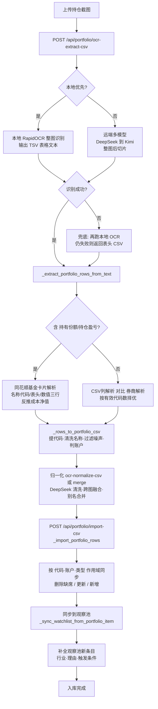
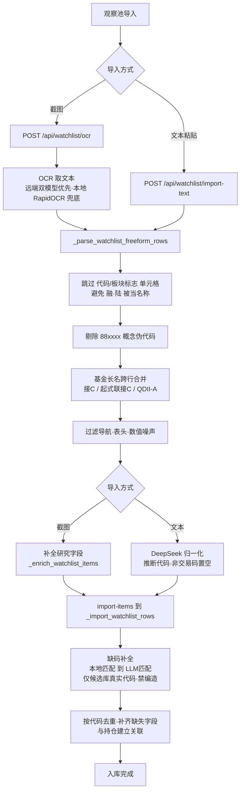

  

 

<h1 align="center"> RedPepper · 红椒 | 用户使用手册</h1>

  <b>A股个人投资基础设施 | dev. by Magic Leon Studio</b>  
  <i>Your Personal Investment Digital Companion</i>

  
  
  
  

---

# 1. 关于导入
RedPepper 针对的是 A 股用户，为了照顾 A 股用户的使用习惯，对“同花顺”手机APP + “同花顺”PC版本软件的个人 Setup 进行了兼容。

## 1.1 持仓导入逻辑

持仓导入支持两种来源：**手机/PC 截图 OCR** 与 **PC 端 .txt 文件**。核心链路为「提取 CSV → 归一化 → 入库同步」三段式。

### 1.1.1 截图导入运行流程

**第 1 步：提取 CSV（`POST /api/portfolio/ocr-extract-csv`）**

后端 `_extract_portfolio_csv_with_kimi()` 采用「本地优先 → 远端多模型 → 兜底降级」策略：

1. **本地优先**（`ai.local_ocr.prefer_local=true`）：使用本地 RapidOCR 对**整图**识别（保留顶部「同花顺钱包/账户资产」表头用于账户判定），输出按视觉行还原、制表符分列的表格文本（TSV）。
2. **远端多模型**：若本地未命中，依次尝试 DeepSeek-v4-flash、Kimi-k2.6，先整图后切片，返回 CSV 文本。
3. **兜底降级**：仍失败时再跑一次本地 OCR；若为空则返回仅含表头的可编辑 CSV，避免硬失败（不再返回 500/422）。

**第 2 步：表格文本 → 结构化行（`_extract_portfolio_rows_from_text`）**

- 若文本含「持有份额/持仓盈亏」→ 走**同花顺基金卡片解析** `_parse_ths_fund_cards_text`：
  每只基金为三行（`名称（代码）` / 指标表头 / 数值行），按表头列名映射 `持有份额→份额`、`当前市值→市值`、`最新净值→现价`、`持仓盈亏→盈亏`，并反推 `成本净值 =（市值 − 盈亏）/ 份额`。
- 否则同时运行「按表头列位置的 CSV 解析」与「券商/文本解析」，**按恢复出的有效 6 位代码数量择优**（解决券商表首列勾选框导致的整列左移错位）。

**第 3 步：生成标准 CSV（`_rows_to_portfolio_csv`）**

- 字段固定为 `code,name,type,shares,cost_price,current_price,profit,amount,account,status`；
- 提取 6 位代码；清洗名称（去掉 OCR 残留的尾部括号，如「永赢…C（」→「永赢…C」）；
- **过滤噪声行**：账户/产品标签（同花顺钱包/收益宝/账户资产等，无论有无代码一律剔除）、纯数字/`null`/版块标签（无代码时剔除）；
- **账户识别**：`_is_ths_fund_source` 识别「同花顺钱包/理财/基金」等关键词 → 同花顺基金，否则中信证券。

**第 4 步：归一化（`POST /api/portfolio/ocr-normalize-csv` 或多图 `ocr-merge-normalize-csv`）**

- `_normalize_portfolio_rows_with_deepseek()` 交由 DeepSeek 清洗、跨图融合与模糊合并（如「科创50」==「科创50ETF」取信息最全一行）；
- 账户规则已加固：账户列已是「同花顺基金」时保留，不被改回中信；港美股/概念板块置空代码。

**第 5 步：入库与同步（`POST /api/portfolio/import-csv` → `_import_portfolio_rows`）**

- 以 `(代码或名称, 账户, 类型)` 为键做**作用域同步**：同一（账户,类型）作用域下、本次未出现的既有持仓会被删除（快照式同步），变更的更新，新的新增；
  > ⚠️ 账户判定正确是关键：同花顺基金导入只影响（同花顺基金,基金）作用域，不会误删中信证券账户下的基金。
- 入库后逐条同步到观察池 `_sync_watchlist_from_portfolio_item`；
- 对同步新建的观察池条目调用 `enrich_watchlist_db_items` **自动补全**行业(sector)、观察理由(reason)、触发条件(trigger_condition)，只补空缺不覆盖已填。

**优点**：股票/基金双账户均支持，多张互补截图可融合（一张有代码、一张有市值），ETF 别名自动匹配，缺字段可在预览弹窗手动补全；有名称即可入库，不因缺代码失败。
**缺点**：初始识别精度依赖截图清晰度，个别名称可能轻微截断（如「科创50ET」），需人工核对。

### 1.1.2 .txt 文件导入

PC 端「同花顺」导出的 .txt → DeepSeek-v4-flash 格式匹配并入库。信息完整；但基金账户目前尚无稳定导出方式。

### 1.1.3 持仓导入流程图

## 1.2 观察池导入逻辑

观察池导入支持 **截图 OCR** 与 **文本粘贴** 两种通道，均以「解析 → 代码补全/校验 → 补全研究字段 → 入库」为主线。

### 1.2.1 截图导入运行流程（`POST /api/watchlist/ocr` → `import-items`）

**第 1 步：OCR 取文本**
远端双模型（DeepSeek/Kimi）优先；失败时本地 RapidOCR（watchlist 模式）兜底，输出 TSV；全链路失败则降级为空响应而非中断导入。

**第 2 步：解析行（`_parse_watchlist_freeform_rows`）**
- 从代码单元格取 6 位代码；选名称时**跳过代码单元格与纯板块标志单元格**（融/陆/沪/深 等），避免把「融」「陆」当成名称；
- **剔除非交易伪代码**：同花顺概念/板块指数（`88xxxx`，如 885517 机器人概念、886033 CPO）会被清除，防止“不存在的代码”入库；
- **基金长名跨行合并**：OCR 把长基金名换行拆出的无码碎片（`接C`/`起式联接C`/`QDII)A`）会拼回上一行，得到完整名称；
- **过滤噪声名称**：导航/表头（美股/自选股/基金代码/场内基金…）与被误当名称的“值”（如 `505.15亿`/`1A0001`）；
- 截图路径仅保留「有可交易代码 + 名称」的行入库，无码的港美股/概念名（阿里巴巴-W、机器人概念等）被丢弃。

**第 3 步：补全研究字段（`_enrich_watchlist_items`）**
DeepSeek + 关键词兜底，补 `sector/reason/trigger_condition/rating/type`。

**第 4 步：入库（`_import_watchlist_rows`）**
- `_force_fill_missing_watchlist_codes` 对缺代码行先本地匹配（已有观察池/持仓名称），再 LLM 匹配；
  **LLM 仅允许返回候选库中真实存在的代码，并做可交易性二次校验，严禁编造代码**；
- 按代码去重，命中已有条目时补齐缺失字段（upsert），最后与持仓建立关联。

### 1.2.2 文本粘贴导入（`POST /api/watchlist/import-text`）

同花顺原始文本（可仅名称列）直接粘贴 → `_parse_watchlist_freeform_rows` → `_normalize_watchlist_rows_with_deepseek`（推断代码 + 补全字段，非交易伪代码一律置空）→ `_import_watchlist_rows` 入库（同代码补齐缺失字段，不再仅重复跳过）。

### 1.2.3 观察池导入流程图

## 1.3 今日更新（2026-06-11，不升级版本号）

**观察池导入链路**
- 剪贴板导入改为“文本导入”通道：支持同花顺原始文本（仅名称列）直接粘贴
- 后端新增 `/api/watchlist/import-text`：先解析文本，再由 DeepSeek 补全/归一化后入库
- 同代码导入命中已有观察池条目时，支持补齐已有条目的缺失字段，不再仅做重复跳过

**导入进度与稳定性**
- 文本导入使用独立进度模式（不再显示截图OCR相关文案与图片预览）
- 长耗时导入接口已调高超时阈值，降低超时失败概率

**仪表盘模型对话（新增）**
- 仪表盘新增“模型对话”入口，支持：`kimi-k2.6`、`deepseek-v4-flash`、`deepseek-v4-pro`
- 上传入口统一为“上传附件”（支持多文件一次选择）
- 附件能力边界：
  - Kimi：文本附件 + 图片附件（多图识别）
  - DeepSeek：文本附件
- 会话区升级为左右气泡样式（用户右、模型左），代码块卡片化并支持一键复制

**已修复问题**
- 修复仪表盘快捷操作“查看持仓”按钮无响应
- 修复 Kimi 聊天 `invalid temperature` 导致的 gateway 报错

